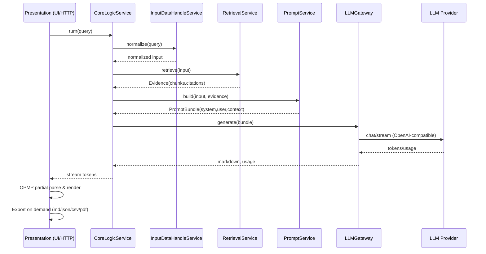

# DocAI Project Description:
DocAI is a LLM RAG Web Application which enable users to chat, query, and ask the documents you uploaded. 
It adopts


Awesome—let’s shape your architecture around those three layers and the concrete services you listed. 
Below is a crisp, production-oriented blueprint with interfaces, data contracts, flow, and a runnable-ish 
skeleton you can drop into a repo.

---

## Layered Architecture (Foundation → Services → Presentation)

### 0) Overall dependency rule

* **Presentation → Services → LLM Provider**
* No inward dependency reversal (keep the core clean; use interfaces).

```
app/
 ├─ presentation/           # HTTP streaming, UIs, adapters for OPMP & exports
 ├─ services/               # business/application services (pure python where possible)
 ├─ llm_providers/          # provider adapters (OpenAI-compatible)
 ├─ retrieval_providers/    # Milvus/FAISS/DuckDB adapters (optional, via interfaces)
 ├─ domain/                 # Pydantic models, state enums, DTOs, errors
 ├─ infra/                  # logging, config, caching, queues
 └─ main.py                 # FastAPI/ASGI entry
```

---

### 1) Foundation Layer

#### Goals

* Provide One **OpenAI-compatible** LLM client interface.
* Currently only provide the **Ollama** providers.
* Provide Retrieval Client Interfaces.
* DataBases include Milvus, Sqlite, Redis, MongoDB
* Support: chat, streaming, tool-calls (optional), history, retries, timeouts.

#### Core interface

```python
#llm_providers/llm_base.py
from typing import Iterable, List, Optional, Dict, Any
from pydantic import BaseModel

class ChatMessage(BaseModel):
    role: str
    content: str

class ChatRequest(BaseModel):
    model: str
    messages: List[ChatMessage]
    temperature: float = 0.2
    max_tokens: Optional[int] = None
    tools: Optional[List[Dict[str, Any]]] = None
    tool_choice: Optional[str] = None
    extra: Dict[str, Any] = {}        # provider-specific (e.g., top_p, presence_penalty)

class ChatChunk(BaseModel):
    delta: str                         # token fragment
    finish_reason: Optional[str] = None

class ChatResponse(BaseModel):
    text: str
    usage: Dict[str, int] = {}

class LLMClient:
    def chat(self, req: ChatRequest) -> ChatResponse: ...
    def stream(self, req: ChatRequest) -> Iterable[ChatChunk]: ...
```
```python db_provider/db_base
[to add database client codes base class]
```

#### OpenAI-compatible client

```python
# llm_providers/openai_compat.py
import httpx
from .base import LLMClient, ChatRequest, ChatResponse, ChatChunk

class OpenAICompatClient(LLMClient):
    def __init__(self, base_url: str, api_key: str | None = None, timeout: int = 60):
        self.base_url = base_url.rstrip("/")
        self.api_key = api_key
        self.http = httpx.Client(timeout=timeout)

    def _headers(self):
        h = {"Content-Type": "application/json"}
        if self.api_key:
            h["Authorization"] = f"Bearer {self.api_key}"
        return h

    def chat(self, req: ChatRequest) -> ChatResponse:
        r = self.http.post(
            f"{self.base_url}/v1/chat/completions",
            headers=self._headers(),
            json={
                "model": req.model,
                "messages": [m.model_dump() for m in req.messages],
                **req.extra
            },
        )
        r.raise_for_status()
        data = r.json()
        text = data["choices"][0]["message"]["content"]
        usage = data.get("usage", {})
        return ChatResponse(text=text, usage=usage)

    def stream(self, req: ChatRequest):
        with self.http.stream(
            "POST",
            f"{self.base_url}/v1/chat/completions",
            headers=self._headers(),
            json={
                "model": req.model,
                "stream": True,
                "messages": [m.model_dump() for m in req.messages],
                **req.extra
            },
        ) as r:
            r.raise_for_status()
            for line in r.iter_lines():
                if not line or not line.startswith("data: "): 
                    continue
                if line == "data: [DONE]":
                    yield ChatChunk(delta="", finish_reason="stop")
                    break
                payload = line.removeprefix("data: ")
                # parse SSE chunk safely
                try:
                    j = __import__("json").loads(payload)
                    delta = j["choices"][0]["delta"].get("content", "")
                    finish = j["choices"][0].get("finish_reason")
                    if delta:
                        yield ChatChunk(delta=delta, finish_reason=finish)
                except Exception:
                    continue
```

#### Retrieval Clients: provide adapters for milvus, FAISS, duckdb, postgresql, redis, mongodb.

```python
#retrieval_provider/retrieval_base.py
[define abstract class of rerieval_base and using template method design pattern]
def __init__(self, store)
def retrieval_methods(self, turn: TurnInput) -> Evidence

```

```python
# services/retrieval_{dbtype}.py
from domain.models import Evidence, TurnInput
class RetrievalService:
    def __init__(self, store):
        self.store = store    # composition: any vector store adapter

    def retrieve_milvus(self, turn: TurnInput) -> Evidence;
    def retrieve_duckdb(self, turn: TurnInput) -> Evidence;
    .......
```
---

## 2) Services Layer

### Domain models & state

```python
# domain/models.py
from enum import Enum
from pydantic import BaseModel
from typing import List, Dict, Any, Optional

class SessionState(str, Enum):
    READY = "READY"
    RETRIEVING = "RETRIEVING"
    PROMPTING = "PROMPTING"
    GENERATING = "GENERATING"
    PARSING = "PARSING"
    DONE = "DONE"
    ERROR = "ERROR"

class TurnInput(BaseModel):
    user_text: str
    attachments: List[str] = []

class Evidence(BaseModel):
    chunks: List[Dict[str, Any]]
    citations: List[str] = []

class PromptBundle(BaseModel):
    system: str
    user: str
    context: str = ""
    tools: List[Dict[str, Any]] = []

class TurnOutput(BaseModel):
    markdown: str
    state: SessionState
    usage: Dict[str, int] = {}
    meta: Dict[str, Any] = {}
```

### CoreLogicService

* Orchestrates a turn using the other services.

```python
# services/core_logic.py
from domain.models import *
from .prompt_service import PromptService
from .retrieval_service import RetrievalService
from .state_transition_service import StateTransitionService
from .input_data_service import InputDataHandleService
from .llm_gateway import LLMGateway

class CoreLogicService:
    def __init__(self, prompt: PromptService, retriever: RetrievalService,
                 state: StateTransitionService, input_svc: InputDataHandleService,
                 llm: LLMGateway):
        self.prompt = prompt
        self.retriever = retriever
        self.state = state
        self.input = input_svc
        self.llm = llm

    def run_turn(self, session_id: str, turn: TurnInput) -> TurnOutput:
        s = self.state.advance(session_id, SessionState.READY, SessionState.RETRIEVING)
        preprocessed = self.input.normalize(turn)

        ev = self.retriever.retrieve(preprocessed)
        self.state.set(session_id, SessionState.PROMPTING)

        bundle = self.prompt.build(preprocessed, ev)
        self.state.set(session_id, SessionState.GENERATING)

        md, usage = self.llm.generate(bundle)
        self.state.set(session_id, SessionState.PARSING)

        # no transformation here; presentation handles optimistic parsing
        self.state.set(session_id, SessionState.DONE)
        return TurnOutput(markdown=md, state=SessionState.DONE, usage=usage)
```

### InputDataHandleService

* Cleans user text, extracts keywords, handles file attachments.

```python
# services/input_data_service.py
from domain.models import TurnInput
class InputDataHandleService:
    def normalize(self, turn: TurnInput) -> TurnInput:
        text = turn.user_text.strip()
        # TODO: language detect, redact PII, strip control chars, etc.
        return TurnInput(user_text=text, attachments=turn.attachments)
```

### PromptService

* Composes **system / context / user** with guardrails.

```python
# services/prompt_service.py
from domain.models import PromptBundle, TurnInput, Evidence

SYSTEM_BASE = (
"You are a helpful assistant. Use provided CONTEXT faithfully. "
"Prefer citations when available. Respond in Markdown."
)

class PromptService:
    def build(self, turn: TurnInput, ev: Evidence) -> PromptBundle:
        context = "\n\n".join([c.get("text", "") for c in ev.chunks[:10]])
        system = SYSTEM_BASE + "\n\nCONTEXT:\n" + (context or "N/A")
        return PromptBundle(system=system, user=turn.user_text, context=context, tools=[])
```

### StateTransitionService

* Small finite-state machine (FSM) with validation.

```python
# services/state_transition_service.py
from domain.models import SessionState
from typing import Dict

ALLOWED = {
    "READY": {"RETRIEVING"},
    "RETRIEVING": {"PROMPTING", "ERROR"},
    "PROMPTING": {"GENERATING", "ERROR"},
    "GENERATING": {"PARSING", "ERROR"},
    "PARSING": {"DONE", "ERROR"},
    "DONE": set(), "ERROR": set()
}

class StateTransitionService:
    def __init__(self):
        self._states: Dict[str, SessionState] = {}

    def set(self, sid: str, new: SessionState):
        cur = self._states.get(sid, SessionState.READY)
        if new.name not in ALLOWED[cur.name]:
            raise RuntimeError(f"Illegal transition {cur} -> {new}")
        self._states[sid] = new

    def advance(self, sid: str, expect: SessionState, new: SessionState):
        cur = self._states.get(sid, SessionState.READY)
        if cur != expect:
            # tolerate first call when nothing stored
            self._states[sid] = new
        else:
            self.set(sid, new)
        return self._states[sid]
```

### LLMGateway (ties Services→Provider)

```python
# services/llm_gateway.py
from typing import Tuple
from domain.models import PromptBundle
from llm_providers.base import ChatRequest, ChatMessage, LLMClient

class LLMGateway:
    def __init__(self, client: LLMClient, default_model: str):
        self.client = client
        self.model = default_model

    def generate(self, bundle: PromptBundle) -> Tuple[str, dict]:
        req = ChatRequest(
            model=self.model,
            messages=[
                ChatMessage(role="system", content=bundle.system),
                ChatMessage(role="user", content=bundle.user),
            ],
            extra={"temperature": 0.2}
        )
        resp = self.client.chat(req)
        return resp.text, resp.usage
```

---

## 3) Presentation Layer

### A) Optimistic Progressive Markdown Parsing (OPMP)

Goal: render *as tokens stream in* (SSE), while staying robust to malformed Markdown.

**Algorithm (stream handler):**

1. Maintain a **token buffer** and a **parse cursor**.
2. As chunks arrive:

   * Append to buffer.
   * Try to parse *only the new suffix* with a tolerant parser.
   * Close any **open constructs optimistically** (tables, lists, fenced code) for rendering; mark them as **tentative**.
   * If later chunks fix structure (e.g., closing ```), **reconcile** and re-render the affected region.
3. Expose **checkpoints** (e.g., after headings, paragraph end, or fenced code fence) to minimize reflows.

**Server streaming endpoint (FastAPI):**

```python
# presentation/http_stream.py
from fastapi import APIRouter
from fastapi.responses import StreamingResponse
from services.core_logic import CoreLogicService
from domain.models import TurnInput

router = APIRouter()

@router.post("/chat/stream")
def chat_stream(payload: dict):
    svc: CoreLogicService = router.svc  # injected at startup
    turn = TurnInput(user_text=payload["query"], attachments=payload.get("attachments", []))

    def gen():
        # call the llm provider streaming directly for OPMP
        bundle = svc.prompt.build(turn, svc.retriever.retrieve(turn))
        req = svc.llm._to_request(bundle)  # or expose a stream() method
        for chunk in svc.llm.client.stream(req):
            yield f"data: {chunk.model_dump_json()}\n\n"
    return StreamingResponse(gen(), media_type="text/event-stream")
```

**Client-side OPMP (pseudo):**

* Maintain `renderState`.
* On each SSE `delta`:

  * `buffer += delta`
  * `render(partialParse(buffer))`
  * If parser detects an unmatched code fence/table: render with a ghost closing fence; mark as tentative.
  * On reconciliation: replace tentative blocks with finalized blocks.

### B) Data Export

* Export the final **TurnOutput.markdown** to multiple formats.

```python
# presentation/exports.py
from domain.models import TurnOutput

class Exporter:
    def to_markdown(self, out: TurnOutput) -> str:
        return out.markdown

    def to_json(self, out: TurnOutput) -> dict:
        return {"markdown": out.markdown, "usage": out.usage, "meta": out.meta}

    def to_csv(self, out: TurnOutput) -> str:
        # trivial example: split headings/paragraphs
        import csv, io, re
        rows = []
        for block in re.split(r"\n\s*\n", out.markdown.strip()):
            rows.append([block.replace("\n","\\n")[:32000]])
        buf = io.StringIO()
        csv.writer(buf).writerows(rows)
        return buf.getvalue()

    # For PDF/HTML: run markdown-it/MD to HTML then to PDF via wkhtmltopdf/WeasyPrint
```

---

## Request Flow (Sequence)



---

## FastAPI wiring (minimal)

```python
# main.py
from fastapi import FastAPI
from llm_providers.openai_compat import OpenAICompatClient
from services.llm_gateway import LLMGateway
from services.core_logic import CoreLogicService
from services.prompt_service import PromptService
from services.retrieval_service import RetrievalService
from services.input_data_service import InputDataHandleService
from services.state_transition_service import StateTransitionService
from presentation.http_stream import router as stream_router

def build_app():
    app = FastAPI()
    # Choose one provider at deploy-time:
    client = OpenAICompatClient(base_url="http://localhost:11434")   # Ollama
    llm = LLMGateway(client, default_model="llama3:8b-instruct")
    retriever = RetrievalService(store=YourVectorStore())             # impl elsewhere

    svc = CoreLogicService(
        prompt=PromptService(),
        retriever=retriever,
        state=StateTransitionService(),
        input_svc=InputDataHandleService(),
        llm=llm
    )
    stream_router.svc = svc
    app.include_router(stream_router, prefix="/api")
    return app

app = build_app()
```

---

## Testing strategy (quick hits)

* **Unit**: PromptService (context assembly), StateTransitionService (legal transitions), RetrievalService (rank/recall), LLMGateway (mock provider).
* **Contract**: One test suite per **OpenAI-compatible** endpoint (Ollama/vLLM/llama.cpp) asserting JSON schema and streaming SSE conformance.
* **OPMP**: snapshot tests on progressively longer token streams (tables, code fences, nested lists).
* **Exports**: golden files for md/json/csv; visual diff for PDF.

---

## Where to extend

* Tool-calling (function calling) in `LLMGateway` by passing `tools` via `PromptBundle.tools`.
* Caching: add `infra/cache.py` (e.g., Redis) to memoize retrieval & partial prompts.
* Telemetry: usage tokens + latencies to `infra/metrics.py` (OpenTelemetry).
* Guardrails: add safety filters in `InputDataHandleService`.

---

If you’d like, I can drop this into a **ready-to-run skeleton repo** (with FastAPI, a minimal OPMP web client, and a mock retrieval adapter) or tailor the retrieval adapter to **Milvus + DuckDB** like you typically use.
